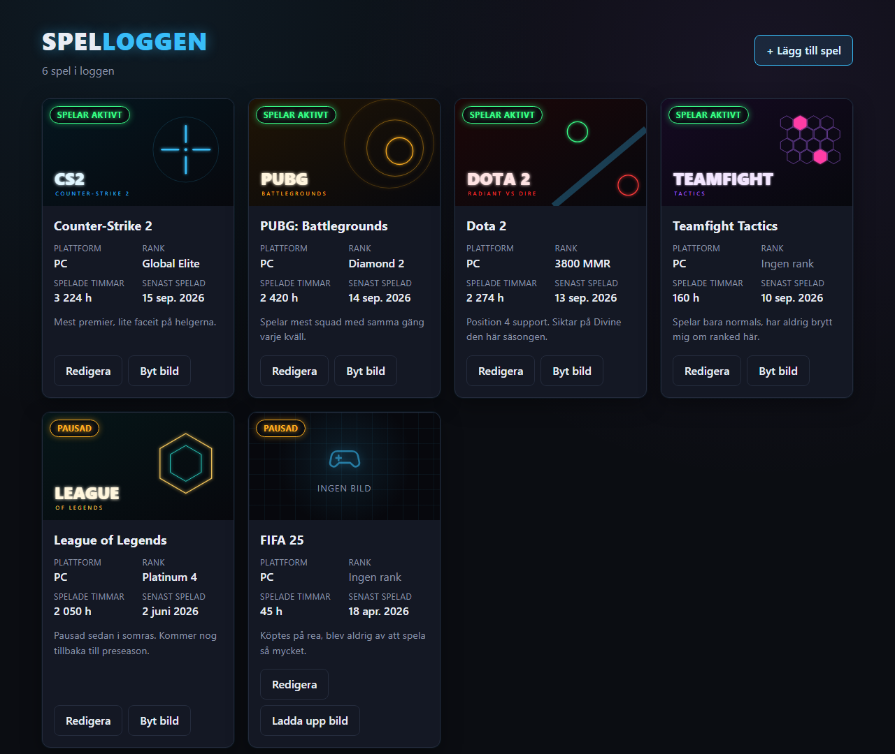
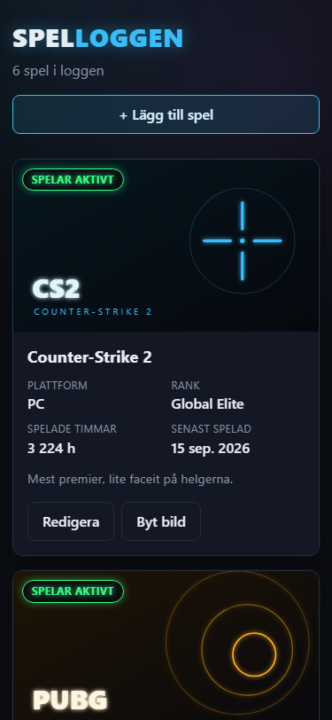

# Spelloggen

A list of the games I play: the title, the platform, my rank, how many hours I have played and
a note. I can add a game, change one, and put a cover image on it.

This repo is the **web app**, made with React.
The **backend** is in another repo: https://github.com/ThanosMakedas/spelloggen-api

Both have to run at the same time.

## What it looks like



On a phone the cards go to one per row:



## Before you start

| Needed | Version | Check with |
|---|---|---|
| .NET SDK | 10.0 | `dotnet --version` |
| Node.js | 20.19 or later, or 22.12 or later | `node --version` |

Nothing else to install.

## 1. Start the backend

```
git clone https://github.com/ThanosMakedas/spelloggen-api.git
cd spelloggen-api
dotnet run
```

The API now runs on **http://localhost:5080**. Leave that terminal open.
The first time, it creates the database and puts six games in it.

## 2. Start the web app

In a **second terminal**, so the API keeps running in the first one:

```
git clone https://github.com/ThanosMakedas/spelloggen-web.git
cd spelloggen-web
npm install
npm run dev
```

The app now runs on **http://localhost:5173**. Open that address in a browser.

If port 5173 is busy, the app stops and says so. Close whatever is using it and start again.

## What you can do

- See all the games as cards
- **+ Lägg till spel** adds a game
- **Redigera** changes a game
- **Ladda upp bild** or **Byt bild** puts a cover image on a game

Two of the games have no rank and one has no cover image on purpose, so you can see that empty
fields do not break the page.

## If the API is not running

Stop the API and reload the page. The app shows a red message with a **Försök igen** button
instead of crashing. Start the API again, press the button, and the list comes back.

## Two screen sizes

On a computer the cards are in a grid. On a phone, 600 px and below, there is one card per row.
To try it: F12 in the browser, then Ctrl+Shift+M.

## Why I built it this way

**React with Vite.** Vite starts the app in about a second and updates the page as soon as I
save a file, so I could see every change right away.

**No extra libraries.** Only React. The list, the form and the upload are written by hand, so I
know what every part does.

**Plain CSS.** The app is dark with neon colors, which is really just colors and shadows. A
design library would have been a big thing to install for a look it does not have anyway. All
the colors are at the top of `index.css`, so they are easy to change.

**One file for the API calls, `src/api.js`.** No other file talks to the API. If the address
changes or an error message needs fixing, there is only one place to look. The address itself
is in the file `.env`.

**One component per file.** `SpelCard.jsx` is one card, `SpelForm.jsx` is the form, and each one
has its own CSS file next to it, so things are easy to find.

**Errors are always shown.** If the API does not answer, the page says so in Swedish instead of
staying empty. If saving fails, the form stays open with what I wrote, so nothing is lost.

## The files

```
src/
  api.js        all the calls to the API
  App.jsx       keeps the list and decides what to show
  index.css     colors and basic styles
  components/   one file for each part of the page
```
